# 목차

1. [ProjectNF](#projectnf)
2. [DebugHelper](#debughelper)
3. [GameInstance](#gameinstance)

4. [Subsystems](#Subsystems)

5. [SheetDataSubsystem](#sheetdatasubsystem)
6. [GridSubsystem](#gridsubsystem)
7. [InventorySubsystem](#inventorysubsystem)
8. [ObjectSubsystem](#objectsubsystem)
9. [ObjectPoolSubsystem](#objectpoolsubsystem)
10. [ObjectPool](#objectpool)
11. [PuzzleSubsystem](#puzzlesubsystem)

 [Managers](#managers) // 삭제예정

12. [Modules](#modules)
13. [델리게이트 패턴](#델리게이트-패턴)
14. [ETC](#ETC)

# ProjectNF

NF는 New Farm의 줄임말입니다.

예전에 만들었던 농장 경영 시스템은 사용한 코드들이 관리가 힘들고 확장이 어려워지는 문제가 발생하여

관리하기 쉽고 확장이 용이하도록 디자인 패턴을 적용하여 프로젝트의 코드를 리메이크하는 것을 목표로 잡았으며

다른 프로젝트에서도 간편하게 사용할 수 있도록 일종의 프레임워크화 하려는 시도로 제작하는 프로젝트입니다.

# DebugHelper

DebugHelper는 디버그 로그를 사용하면서 불편했던 부분을 개선하기 위해 만든 커스텀 로그 기능입니다.

```
UE_LOG();
GEngine->AddOnScreenDebugMessage();
```
언리얼 엔진에서는 위 코드를 사용하여 로그를 남기는데, 프로젝트를 계속 진행하면서 늘어난 코드에 비례해 로그 코드가 늘어나고, 게임을 실행할 때마다 비활성화하지 못한 로그가 계속 보이고 찾기 힘든 문제점을 가지고 있습니다.

때문에 디버그 로그가 나올 때 어느 코드, 어느 지점에서 디버그가 발생하는지 나타날 수 있게 만들고 싶었습니다.


DebugHelper.h / .cpp는 그런 기능을 만들어 놓은 코드입니다.

__FUNCTION__ 매크로를 기반으로 만든 또다른 매크로로, 언리얼 엔진의 TEXT() 매크로를 개선하고 싶은 디버그 환경에 맞게 DEBUG_TEXT()와 DEBUG_VATEXT() 매크로를 만들었습니다.


또한 간단한 로그 사용을 위한 static 함수를 보유한 클래스를 만들었습니다.

bDebugPlay에 의해 프로젝트 내에 있는 모든 로그 코드가 활성/비활성 상태가 될 수 있습니다.

이 로그 시스템을 사용하는 일반적으로 사용하는 방법은 다음과 같습니다.

```

// 단순 로그
FMyDebug::Print(DEBUG_TEXT("abc")); 

//파라미터가 들어간 로그
FMyDebug::Print(DEBUG_VATEXT(TEXT("test log : %s, %s"), *str1, *str2));

```

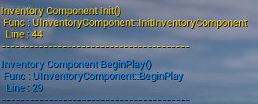
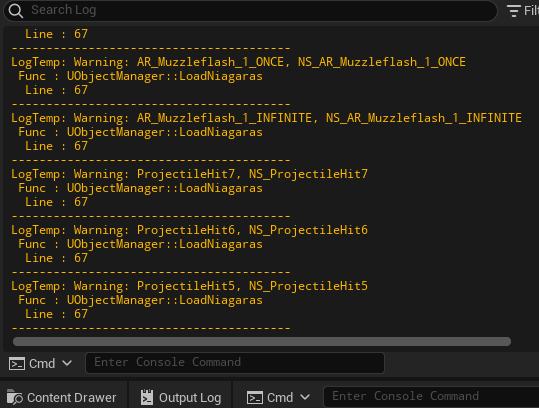

위 스크린샷처럼 로그가 나올 때 로그가 동작한 함수 이름과 어느 위치에 로그 코드가 존재하는지 출력됩니다.

# GameInstance


원래 게임 인스턴스는 Manager를 담아 사용하는 싱글톤 클래스로서 동작했지만,

서브시스템으로 기능을 분리하여 현재는 게임 Load Save기능만 존재합니다.

추후 바뀔 가능성이 있습니다.

# Managers

게임의 주요한 기능을 Manager 단위로 묶어 관리하기 위해 싱글톤 클래스로서 게임인스턴스에 매니저가 포함됐었습니다.

이 기능은 초기에 UObject를 기반으로 만들었는데, UObject기반으로 만든 뒤 GameInstance에 붙이면서 싱글톤으로서 동작하게 되어있었습니다.

그러나 몇몇 기능은 GameInstance와 거리가 먼 기능인데도 GameInstance에 의해 관리되며, 점점 GameInstance에 대해서 기능이 동작하게 만들면서 GameInstance의 기능이 비대해질 가능성이 커졌습니다.

```
예시 : ObjectPool은 오브젝트가 존재할 수 있는 Level이 유효할 때까지만 동작이 가능해야함. 이 기능이 GameInstance에서 관리되다 보니 Level이 바뀌어 Actor의 수명이 끝난 상황에 유효하지 않을 오브젝트를 계속 보유하고 있는 문제점을 가짐

예시2 : Grid는 GetWorld()가 정상적으로 접근이 가능해야 실제로 사용이 가능함. 그러나 GameInstance는 transient 월드에 속하는 오브젝트라 GetWorld()가 실제 플레이어의 World와 다르므로 우회하여 접근할 필요가 있었음. 
```

언리얼 엔진의 서브시스템이라는 기능이 제가 의도한대로 매니저 클래스로서 동작가능한 언리얼 엔진의 기능임을 조사하여 알게된 뒤에 매니저 클래스들을 전부 서브시스템에 맞게 다시 만드는 작업을 하였기에, Manager 클래스들은 전부 Deprecated된 클래스가 됐습니다.

이 매니저 클래스는 삭제될 예정이며, 매니저 클래스를 사용하여 정상적으로 동작하는 프로젝트 기록은 Branch로 Manager_UObject로 아카이브화 하였습니다.

# Subsystems

언리얼 엔진에서 제공하는 Subsystem으로 싱글톤으로서 동작하는 매니저 클래스를 대체합니다.

## SheetDataSubsystem

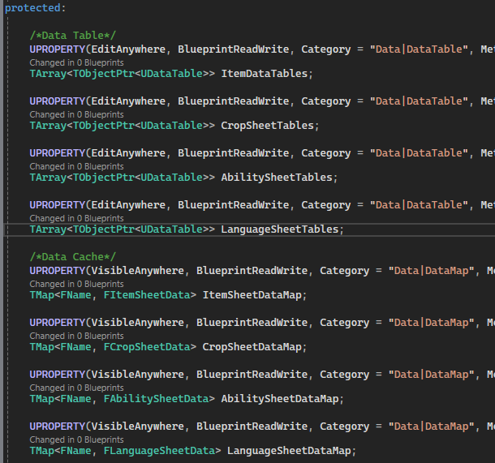

게임에서 사용할 스프레드시트 데이터를 보관하고 관리하는 서브시스템입니다.

SheetDataSubsystem은 GameInstanceSubsystem으로, 게임인스턴스가 유효한 이상 게임 플레이 동안 게임 인스턴스로부터 서브시스템을 접근하고 데이터를 얻어낼 수 있습니다.

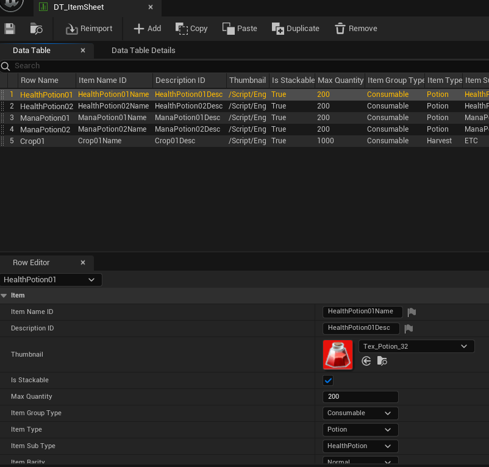
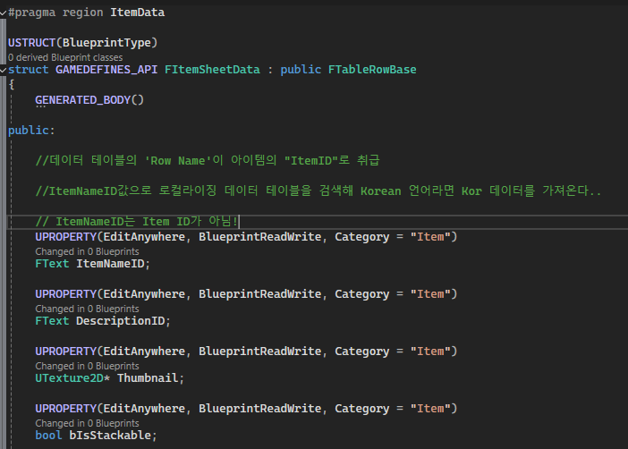

언리얼 엔진의 구조체로 DataTable의 시트 구조를 만든 뒤, DataTable 블루프린트를 만들어 데이터를 관리합니다.

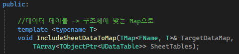
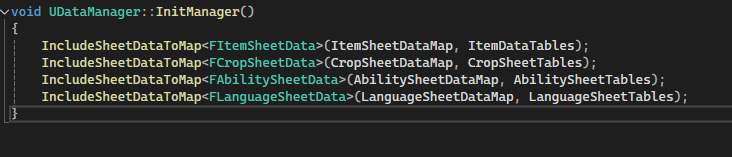

카테고리에 맞춰 데이터 테이블을 분류하여 폴더 단위로 관리합니다.

예를 들면, 아이템과 관련된 데이터 테이블은 /Content/DataTables/ItemDataTables 안에 전부 관리합니다.
LoadDataTables()를 통해 해당 폴더 안에 있는 모든 데이터 테이블을 가져오고, 데이터 테이블의 데이터를 파싱하여 캐시로서 동작하는 ItemSheetDataMap에 저장합니다.

데이터가 필요하다면 SheetDataSubsystem에 접근해 아이템 이름을 알고 있다면 해당 이름을 Key값으로 사용해 원하는 SheetData를 얻어낼 수 있습니다.

```
//사용예시
//Item01에 대한 SheetData를 얻어낼 수 있다.
auto sheetDataSubsystem = GetGameInstance()->GetSubsystem<USheetDataSubsystem>();
FItemSheetData itemData = sheetDataSubsystem->GetItemData(TEXT("Item01"));

```

## GridSubsystem

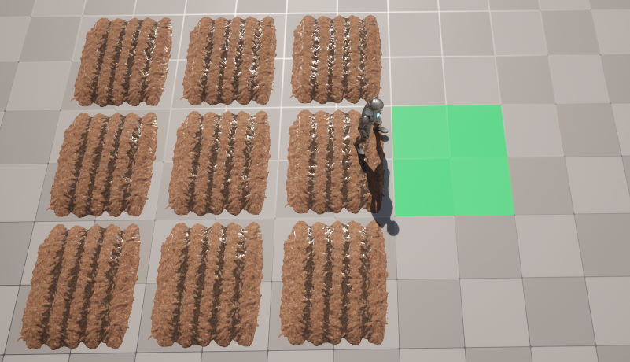

월드를 적절한 크기의 값으로 나누어 만들어진 좌표로 매칭하여 그리드 칸을 관리하기 위한 Subsystem입니다.

GridSubsystem은 UEngineSubsystem으로, 엔진이 동작하는 동안은 유효한 서브시스템으로, GEngine으로 접근하여 서브시스템을 접근할 수 있습니다.

```

//사용예시
auto gridSubsystem = GEngine->GetEngineSubsystem<UGridSubsystem>();
gridSubsystem->WorldToGrid( FVector(100.0f,500.0f,0) );

```

## InventorySubsystem

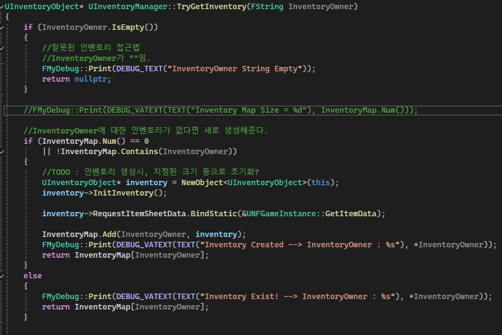

실질적인 인벤토리인 InventoryObject를 관리하는 서브시스템입니다.

InventorySubsystem은 GameInstance가 유효한 동안 접근이 가능하고 계속 데이터를 저장하고 관리할 수 있습니다.

인벤토리를 관리하는 방식을 예를 들면, 플레이어의 캐릭터에겐 InventoryComponent가 존재하며, 이 컴포넌트는 InventoryID를 가지고 있습니다.

InventoryID 값으로 매니저의 InventoryObject를 확인하여, 존재하지 않으면 새로운 인벤토리를 만든 뒤 접근을 허용하며, 존재하는 InventoryObject가 있다면 생성을 스킵하고 접근을 허용합니다.

게임 최초 시작시 플레이어의 인벤토리 오브젝트는 존재하지 않아 새로 생성하지만, 게임을 저장한 뒤 로드하여 재시작하는 경우, 플레이어의 인벤토리는 게임을 시작하는 타이밍에 존재하는 상태이므로, 인벤토리 오브젝트를 새로 생성하지 않고도 접근이 가능합니다.

## ObjectSubsystem

ObjectSubsystem은 Content폴더에 있는 블루프린트로 만들어진 클래스를 전부 게임 시작시 로드하여 사용자가 필요하면 원하는 Key값의 클래스를 Spawn을 도와주는 팩토리 패턴의 Subsystem입니다.

예시로, 이 프로젝트는 액터 블루프린트들을 전부 Blueprints 폴더에 저장했습니다.

게임 시작시 Initialize()에서 /Content/Blueprints 경로로 LoadBlueprints()가 동작하여 Blueprints 폴더에 있는 액터 블루프린트들을 로드합니다. 

이 방법을 사용하면 C++로 만든 액터 블루프린트, 순수하게 에디터에서 블루프린트 기능으로 만든 액터 블루프린트를 구분하지 않고 전부 로드할 수 있습니다. (이 LoadBlueprints()는 AActor::StaticClass()만을 취급하므로, 액터 블루프린트가 아닐 시에는 무시합니다.)

로드한 액터 블루프린트는 "BP_라는 접두어를 제거한 이름"을 Key값으로 사용합니다.

액터 블루프린트 외에도, UI인 UMG도 이와 같은 방식으로 미리 Load할 수 있습니다.

```
//사용예시
auto objectSubsystem = GetGameInstance()->GetSubsystem<UObjectSubsystem>();

//BP_TestActor라는 클래스를 Spawn한다.
objectSubsystem->Spawn(TEXT("TestActor"),Location,Rotation);

//BP_ItemPickup을 Spawn한다.
//단, ItemPickup은 IObjectPoolable 인터페이스를 상속받은 Poolable 클래스다.
//실제로는 오브젝트 풀링에 의해, 비활성화된 오브젝트를 활성화하여 가져올 수 있다.
//자세한 내용은 밑에 서술할 ObjectPoolSubsystem에서 설명함.
objectSubsystem->Spawn(TEXT("ItemPickup"),Location,Rotation);

//WBP_HUD를 UI 인스턴스로서 생성한다.
objectSubsystem->CreateWidgetBlueprint(TEXT("HUD"), GetOwningPlayer());

//NS_Fire라는 이펙트를 Spawn한다.
objectSubsystem->SpawnNiagaraSystem(TEXT("Fire"), Location, Rotation);

```

widget은 생성시 AddToViewport()를 따로 처리해주어야 합니다.

나이아가라 같은 이펙트 블루프린트는, 언리얼 엔진 내부에서 액터블루프린트 등과는 다른 식으로 취급되므로 LoadNiagaras()로 따로 함수를 만들어 관리합니다.


## ObjectPoolSubsystem

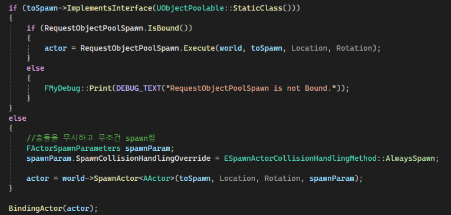

오브젝트 풀링을 위한 서브시스템입니다.

ObjectPoolSubsystem은 사용하고 금방 사라지지만 계속 필요로 하는 오브젝트를 즉각 제거하지 않고, 게임 공간(Level)에 그대로 유지하면서 비활성화 상태로 바꾼 뒤, 필요해질 때마다 오브젝트를 활성화하고 사용하는 방식인 오브젝트 풀링을 구현하여 관리하는 서브시스템입니다.

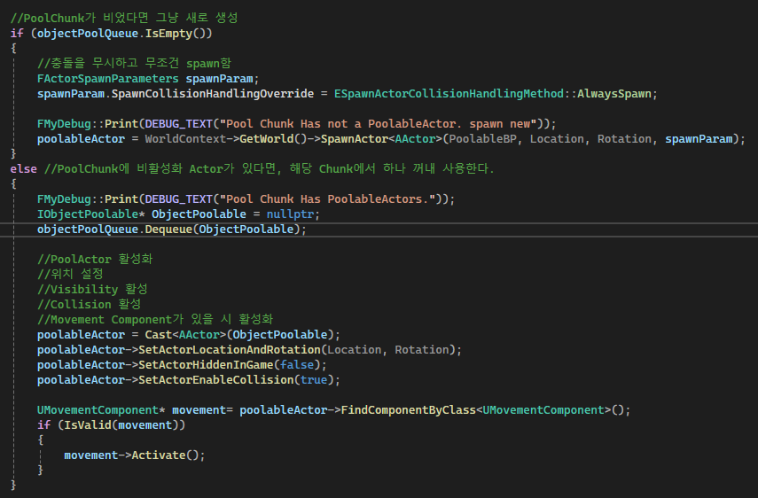

위의 코드대로, ObjectSubsystem에서는 오브젝트 풀링이 가능한 오브젝트인지 확인 후, 오브젝트 풀링 오브젝트라면 ObjectPoolSubsystem에 Spawn을 맡깁니다.
해당 오브젝트 풀에서 남아있는 오브젝트가 있는지 확인하고, 남은 오브젝트가 존재하면 비활성화된 오브젝트를 가져와 사용하고, 없다면 새로 생성해주는 역할을 ObjectSubsystem의 Spawn을 보조해줍니다.

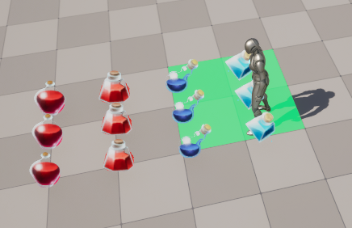
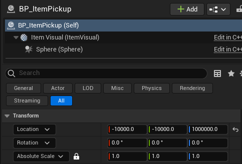

예시 설명으로는, 위의 스크린샷처럼 바닥에 떨어진 ItemPickup 오브젝트들은 오브젝트 풀링이 가능한 오브젝트들입니다.

아이템을 얻으면 시작적으로는 아이템이 사라진 것처럼 보이지만, 실제로는 플레이어가 닿지 않을 공간에 오브젝트를 이동시킨 후 비활성화합니다.

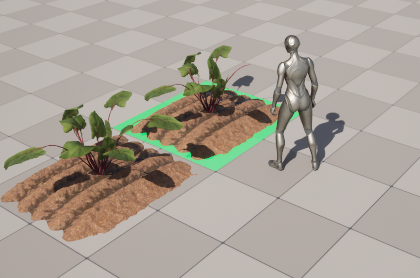
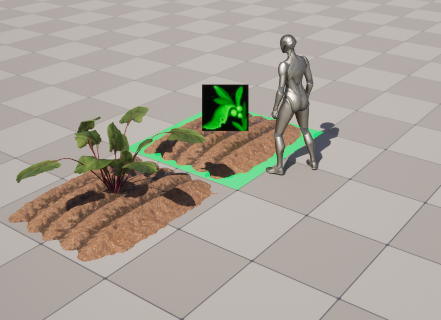
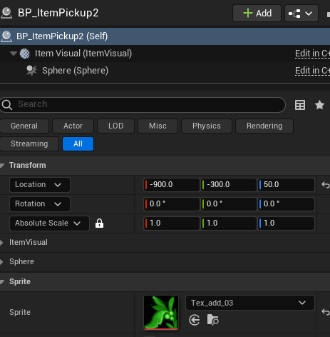

후에 ItemPickup이 맵 공간 어딘가에 생성될 때는 ObjectPoolSubsystem에서 관리된 비활성화된 오브젝트를 활성화하고 원하는 위치에 배치하여 마치 오브젝트가 생성된 것 같은 효과를 얻을 수 있습니다.

### ObjectPool


오브젝트를 생성 및 제거할 때마다 컴퓨터에 메모리 공간을 요청 및 회수를 요청하는데, 이렇게 필요한 순간마다 메모리 공간을 할당 받는 방식은 게임 성능에 영향을 끼칠 수 있습니다.

예를들면, 오브젝트를 1~2개 정도를 생성하는 정도는 아무 문제가 없을 가능성이 크지만, 오브젝트를 매번 한번에 1000개씩 생성하고 1000개씩 삭제하는 로직이 동작한다면 메모리 공간 요청 및 회수 등에 컴퓨터가 많은 작업을 소요하여 게임 프레임에 영향이 있을 가능성이 매우 큽니다.

그러므로 오브젝트 풀링이 가능한 객체는 재사용이 가능한 객체로 판단하여 바로 제거하지 않도록하여 메모리를 회수하지 않게하고, 활성화/비활성화를 하는 방식으로 관리하여 메모리 공간 할당에 의한 성능 저하를 방지할 수 있는 방법입니다.

위의 스크린샷의 코드대로, TMap 클래스에서 Key로 UClass*를 사용해 BP_?? 같은 오브젝트 풀링이 가능한 블루프린트 클래스의 이름을 키값으로 사용하여 PoolChunk 단위로 오브젝트들을 관리합니다.


```
//STL
vector<vector<int>> arr; //가능

//언리얼 컨테이너
TArray<TArray<int32>> arr; // !! 불가능

```

언리얼 컨테이너는 이중 사용이 불가능한 문제를 가지고 있기 때문에 오브젝트 풀 청크라는 클래스를 따로 만들어 청크 오브젝트 안에 오브젝트 풀링에서 사용할 컨테이너로 액터들을 관리합니다.

## PuzzleSubsystem

PuzzleSubsystem은 게임 내에 퍼즐 기믹에 필요한 기능을 동작하기 위한 서브시스템입니다.

예를들어, 맵에 전기적 연결을 사용하는 기믹이 있습니다.

오브젝트끼리 적정 거리에 있다면 오브젝트를 전기적으로 연결하여 전기를 공급하면 맵을 통과하는 방식의 퍼즐 기믹입니다.

이 PuzzleSubsystem은 퍼즐 기믹과 관련된 오브젝트가 Level이 존재하는 동안 유효할 기믹이므로, UWorldSubsystem입니다.

그러므로 Level이 바뀌면 기존 PuzzleSubsystem은 사라지며, 새로운 PuzzleSubsystem이 동작하게 됩니다.

PuzzleSubsystem은 World가 시작될 때, ElectricLinkComponent를 전부 찾은 뒤,

일정한 간격의 시간마다 BFS를 동작하여 전기적 연결을 판단하는 로직을 가지고 있습니다.

전기적으로 연결이 되었다면 ElectricLinkComponent를 활성화하고, 거리가 너무 멀어 전기적으로 연결이 끊기면 비활성화합니다.

전기적 연결이 되었다면, 전기 이펙트가 나와 게임상에서도 전기적으로 연결이 되었음을 확인할 수 있습니다.


# Modules


이 프로젝트는 관리의 용이성을 위해

CustomDebugging - 커스텀 디버깅 코드가 포함된 모듈   
GameDefines - 게임 구조체나 enum, Interface 등을 포함하는 모듈   
GameContents - 실제 게임 기능과 관련된 클래스들을 포함하는 모듈   
GameSystem - Manager, GameInstance, GameMode 등을 포함하는 모듈   
MainModule(ProjectNF) - 플레이어 캐릭터나 UI 등을 포함한 메인 모듈   

이런 방식으로 모듈을 나누어 프로젝트를 관리하고 있습니다. (필요에 따라 더 추가될 수도 있음.)

초기에는 이보다도 모듈을 매우 세분하게 나누어 서로 참조를 하는 방식으로 프로젝트를 구성하여 시작했지만, 점차 모듈 상호 간에 순환적 의존성을 띠는 경고가 나오기에 모듈의 숫자를 줄여 현재 구성으로 관리하는 것으로 변경했습니다.

또한, GameContents의 일부 코드는 GameSystem과 MainModule의 코드 일부를 참조하는 기능을 가지고 있었기에, 의존성을 낮추기 위한 설정이 꼬이는 문제를 가지고 있었습니다.

이 문제를 해결하기 위해 GameContents 모듈에 있는 코드들은 되도록이면 실제 GameInstance의 코드를 직접 참조하지 않고 델리게이트 패턴을 사용하도록 했습니다.

## 델리게이트 패턴

델리게이트 패턴은 델리게이트를 사용하여 객체의 기능을 델리게이트에게 위임하여 기능을 실행하는 디자인 패턴입니다.

객체가 다른 객체의 코드와 결합하는 정도를 의존성(Dependency)으로 부르는데, 의존성이 높을수록 코드가 복잡해지고 관리하기 힘들어집니다.


특히 언리얼 엔진에서는 순환 의존성을 피하도록 권고하고 있으므로, 모듈 간의 순환 의존성이 생기면 고치라는 경고 메시지가 나타납니다.

이를 고치기 위해 언리얼 엔진에서 제공하는 델리게이트를 사용할 수 있습니다.


예를 들면, ItemPickup의 외형을 아이템 정보에 맞게 수정하기 위해서는 ItemSheetData를 확인하여 Thumbnail을 읽어야합니다.

그러나 UNFGameInstance::GetItemData()를 사용하기 위해서는, GameContents 모듈이 GameSystem 모듈을 Dependency 모듈로서 참조해야 사용이 가능합니다. 

문제는 이미 GameModule에서는 GameContents를 Dependency 모듈로서 참조하고 있고, 서로 참조를 하면 순환 의존성이 발생할 수 있습니다.

이를 해결하는 방법은 위의 스크린샷처럼 ItemPickup에서 델리게이트를 선언하고, GameSystem에서 해당 객체를 처음 생성시 델리게이트에 아이템 정보를 얻는 static 함수를 등록하는 것입니다.


ObjectManager에서는 오브젝트를 생성된 뒤에 해당 오브젝트인지 확인 후, 오브젝트의 델리게이트에 싱글톤 클래스의 static 함수를 등록해주는 기능을 포함합니다. 이런 방식을 사용해 모듈간의 순환 의존성을 줄여 사용할 수 있습니다.

# ETC

이 프로젝트에 포함된 기능을 간략하게 소개하면 다음과 같습니다.

## 퍼즐 기믹

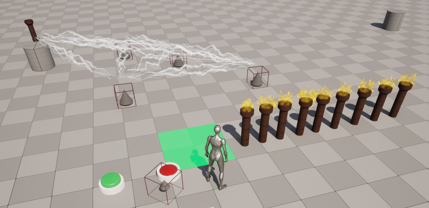

던전맵을 만들 때 퍼즐 기믹들을 만들어 맵을 진행하는 콘텐츠를 제공하고자 만들어진 시스템입니다.

## 아이템 & 인벤토리 시스템

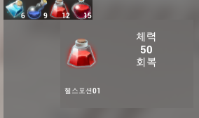

아이템을 얻는 것은 물론, 아이템의 이름과 설명 등의 정보와, 사용시 효과 등을 구현하였습니다.

## 어빌리티 시스템

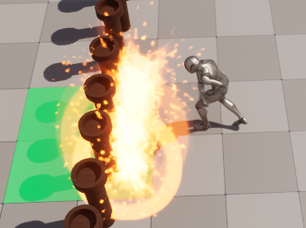


캐릭터가 어빌리티(혹은 스킬)을 가지고 상대를 공격하거나 효과가 나오는 기능을 구현했습니다. 또한. 스킬에 맞는 이펙트를 발동할 수 있도록 데이터시트로 정리한 데이터 기반으로 동작하여, 일부 수치나 에셋의 오류가 있으면 앱의 빌드 바이너리를 수정하지 않고 데이터시트의 pak만 교체하여 오류를 수정할 수 있는 기반을 만들었습니다.