## 목차

1. [ProjectNF](#projectnf)
2. [DebugHelper](#debughelper)
3. [GameInstance](#gameinstance)
4. [Managers](#managers)
5. [DataManager](#datamanager)
6. [GridManager](#gridmanager)
7. [InventoryManager](#inventorymanager)
8. [ObjectManager](#objectmanager)
9. [ObjectPoolManager](#objectpoolmanager)
10. [ObjectPool](#objectpool)
11. [Modules](#modules)
12. [델리게이트 패턴](#델리게이트-패턴)

# ProjectNF

NF는 New Farm의 줄임말입니다.

이번 프로젝트는 기존에 제작했던 프로젝트의 코드를 리메이크하고, 프레임워크화하기 위한 목표로 시작됐습니다.

# DebugHelper

DebugHelper는 디버그 로그를 사용하면서 불편했던 부분을 개선하기 위해 만든 커스텀 로그 기능입니다.

```
UE_LOG();
GEngine->AddOnScreenDebugMessage();
```
언리얼 엔진에서는 위 코드를 사용하여 로그를 남기는데, 프로젝트를 계속 진행하면서 늘어난 코드에 비례해 로그 코드가 늘어나고, 게임을 실행할 때마다 비활성화하지 못한 로그가 계속 보이고 찾기 힘든 문제점을 가지고 있습니다.

때문에 디버그 로그가 나올 때 어느 코드, 어느 지점에서 디버그가 발생하는지 나타날 수 있게 만들고 싶었습니다.

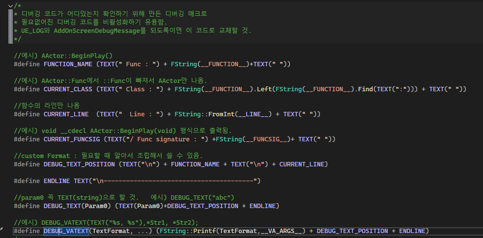

DebugHelper.h / .cpp는 그런 기능을 만들어 놓은 코드입니다.

__FUNCTION__ 매크로를 기반으로 만든 또다른 매크로로, 언리얼 엔진의 TEXT() 매크로를 개선하고 싶은 디버그 환경에 맞추어 DEBUG_TEXT()와 DEBUG_VATEXT()를 만들었습니다.


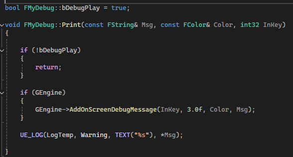


또한 간단한 로그 사용을 위한 static 함수를 보유한 클래스를 만들었습니다.

bDebugPlay를 false로 만든다면

일반적으로 사용하는 방법은 다음과 같습니다.

```
FMyDebug::Print(DEBUG_TEXT("abc"));
FMyDebug::Print(DEBUG_VATEXT(TEXT("%s, %s"), *str1, *str2));
```

# GameInstance

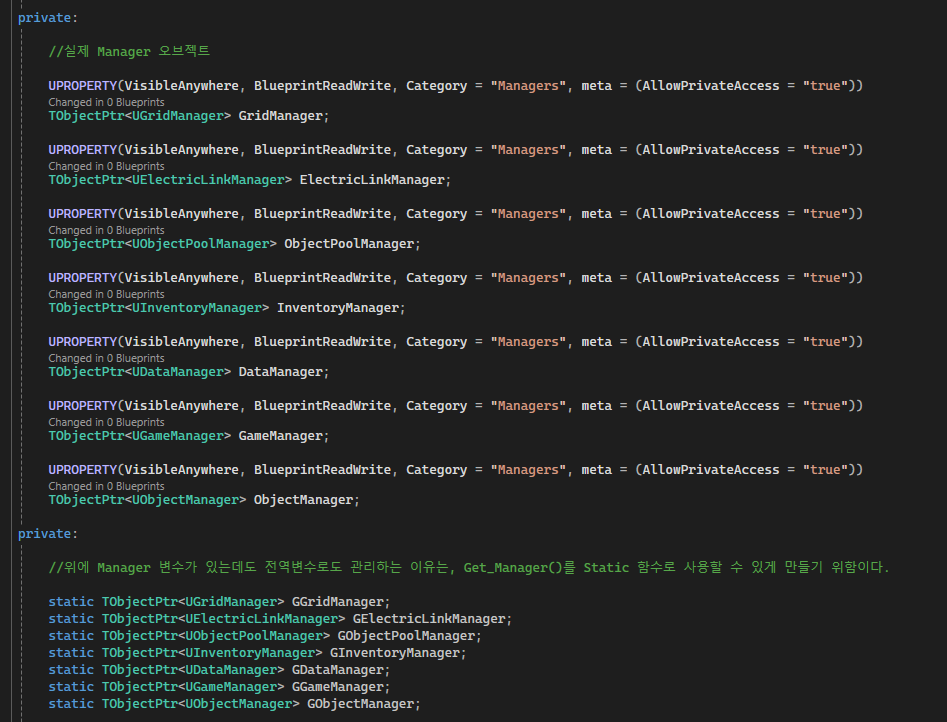

GameInstance는 언리얼 엔진 내에서 레벨이 전환되어도 사라지지 않고 유지되는 객체입니다.

그러므로, GameInstance를 매니저를 모아두는 싱글톤 클래스로서 사용하고 게임 로직과 관련된 Manager들을 전부 GameInstance에서 관리하도록 만듭니다.

# Managers

게임의 주요한 기능을 Manager 단위로 묶어 관리하기 위해 싱글톤 클래스에 매니저를 포함합니다.

## DataManager

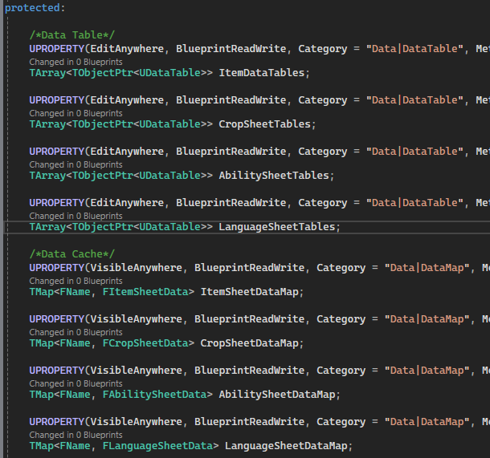

DataManager는 게임에서 사용할 스프레드시트 데이터를 보관하고 관리하는 매니저 클래스입니다.


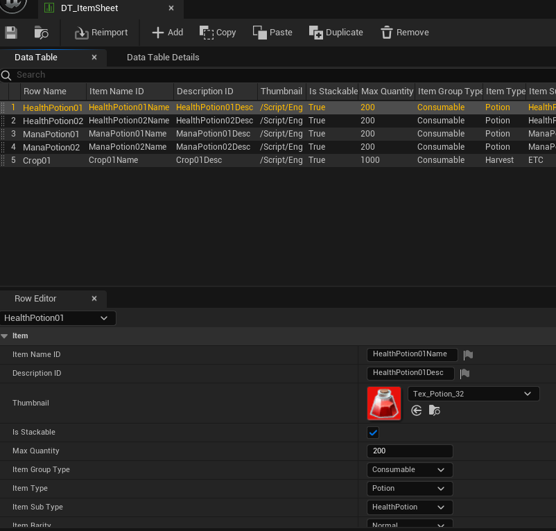
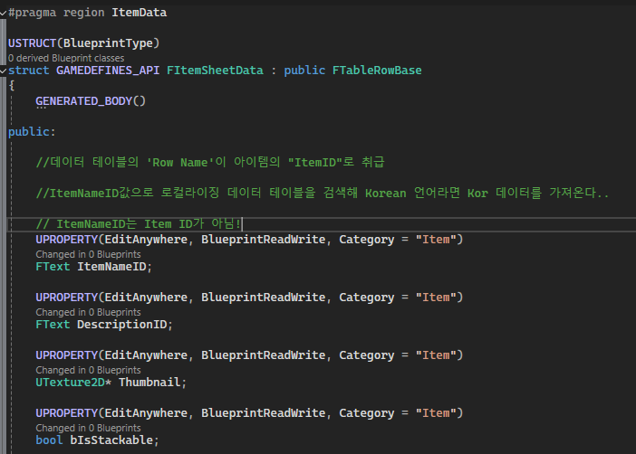

언리얼 엔진의 구조체로 DataTable의 시트 구조만든 뒤 DataTable 블루프린트를 만들어 데이터를 관리합니다.

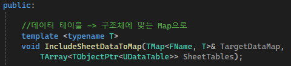
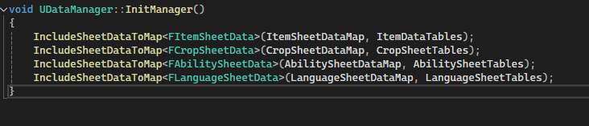

DataTable을 BP_DataManager의 배열로 연결한 뒤, 코드 내에서 template 함수로 각 데이터에 맞춰 SheetData를 로드하여 Map에 옮긴 뒤, 필요할 때마다 Map의 Key값에 맞는 SheetData를 얻어낼 수 있습니다.

```
//사용 예시
//Item01에 해당하는 데이터를 얻어온다.
FItemSheetData data = UNFGameInstance::GetItemData(TEXT("Item01"));
```

## GridManager

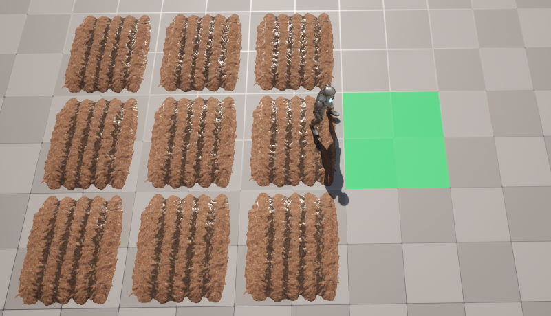

월드를 적절한 크기의 값으로 나누어 만들어진 좌표로 매칭하여 그리드 칸에 농작물을 심고 키우는 시스템의 일부입니다.


## InventoryManager

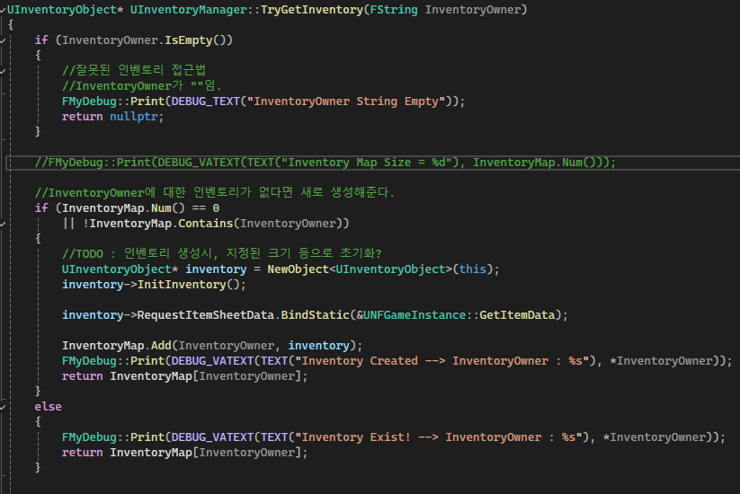


실질적인 인벤토리인 InventoryObject를 관리하는 매니저 클래스입니다.

플레이어의 InventoryComponent에서는 Inventory ID 값이 존재하는데, InventoryID 값으로 매니저의 InventoryObject를 확인하여

존재하지 않으면 새로운 인벤토리를 만들고, 존재하는 InventoryObject가 있다면 접근을 허용합니다.

게임 최초 시작시 플레이어의 인벤토리 오브젝트는 존재하지 않아 새로 생성하지만, 게임을 저장한 뒤 로드하여 재시작하는 경우,

플레이어의 인벤토리는 존재하는 상태이므로, 인벤토리에 접근할 때 인벤토리 오브젝트를 새로 생성하지 않고도 접근이 가능합니다.

## ObjectManager

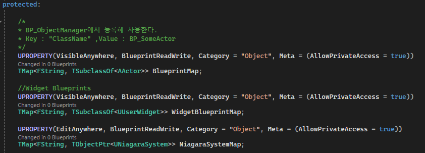

ObjectManager는 Content폴더에 있는 블루프린트로 만들어진 클래스를 전부 게임 시작시 로드하여 사용자가 필요하면 원하는 Key값의 클래스를 Spawn을 도와주는 팩토리 패턴의 매니저 클래스입니다.

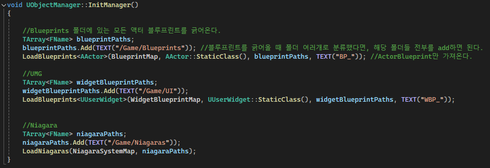

ObjectManager는 게임 시작시 각 종류에 맞는 블루프린트 등의 경로에 맞춰 폴더 안에 있는 모든 블루프린트를 매니저에 로드합니다.

로드한 블루프린트는 "BP_라는 접두어를 제거한 이름"을 제거한 문자열을 Key값으로 사용합니다.

```
//사용예시

//BP_TestActor라는 클래스를 Spawn한다.
UNFGameInstance::Spawn(TEXT("TestActor"),Location, Rotation);

``` 

## ObjectPoolManager

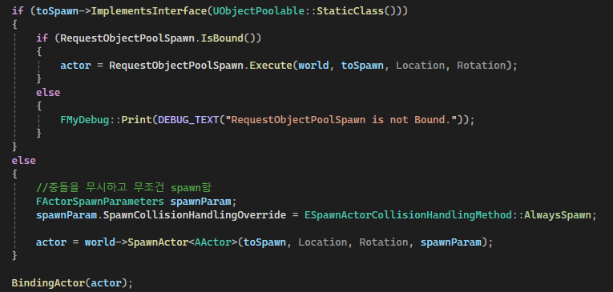

ObjectPoolManager는 사용하고 금방 사라질 수 있는 오브젝트를 Destroy로 바로 제거하지 않고, 게임 공간에 그대로 유지하면서 비활성화 상태로 바꾼 뒤, 필요해질 때마다 기존의 오브젝트를 활성화하고 사용하는 방식인 오브젝트 풀링을 구현하여 관리한 매니저 클래스입니다.

위의 코드대로, ObjectManager에서는 오브젝트 풀링이 가능한 오브젝트인지 확인 후, 오브젝트 풀링 오브젝트라면 ObjectPoolManager에서 Spawn을 맡깁니다.

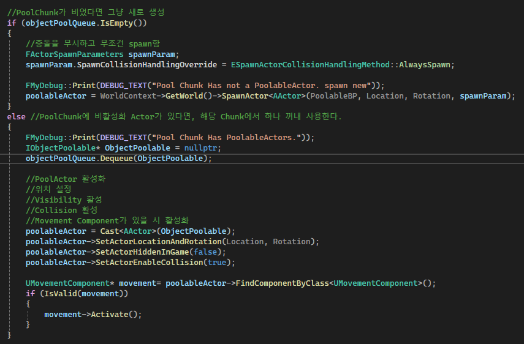

ObjectPoolManager에서는 해당 오브젝트 풀에서 남아있는 오브젝트가 있는지 확인하고, 남은 오브젝트가 존재하면 비활성화된 오브젝트를 가져와 사용하고, 없다면 새로 생성해주는 역할을 ObjectManager의 Spawn을 보조해줍니다.

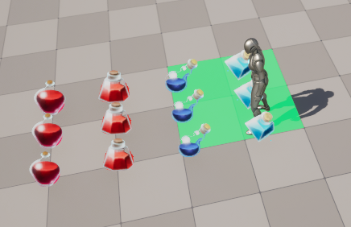

예시 설명으로는, 위의 스크린샷처럼 바닥에 떨어진 ItemPickup 오브젝트들은 오브젝트 풀링이 가능한 오브젝트들입니다.

아이템을 얻으면 시작적으로는 아이템이 사라진 것처럼 보이지만, 실제로는 플레이어가 닿지 않을 공간에 오브젝트를 이동시킨 후 비활성화합니다.

후에 ItemPickup이 맵 공간 어딘가에 생성될 때는 ObjectPoolManager에서 관리된 비활성화된 오브젝트를 활성화하고 원하는 위치에 배치하여 마치 오브젝트가 생성된 것과 비슷한 효과를 얻을 수 있습니다.

### ObjectPool

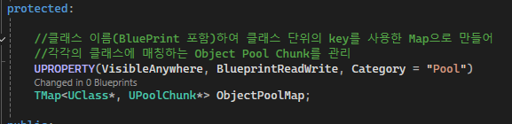

오브젝트를 생성 및 제거할 때, 컴퓨터에 메모리 공간을 요청 및 회수를 요청하는데, 이러한 메모리 공간을 할당 받는 방식은 게임 성능에 영향을 끼칠 수 있습니다. 그러므로 재사용이 가능한 객체는 바로 제거해 메모리를 회수 시키지 않게하면서 활성화/비활성화를 하는 방식으로 관리하여 메모리 공간 할당에 의한 성능 저하를 방지할 수 있는 방법입니다.

위의 스크린샷의 코드대로, TMap 클래스에서 Key로 UClass*를 사용해 BP_?? 같은 블루프린트 클래스 중에서도 오브젝트 풀링이 가능한 객체를 키값으로 사용합니다.

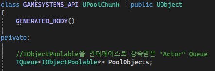

언리얼 컨테이너는 이중 사용이 불가능한 문제를 가지고 있기 때문에 오브젝트 풀 청크라는 클래스를 따로 만들어 청크 오브젝트 안에 오브젝트 풀링이 가능한 액터들을 관리합니다.

# Modules

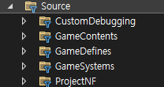

이 프로젝트는 관리의 용이성을 위해

CustomDebugging - 커스텀 디버깅 코드가 포함된 모듈
GameDefines - 게임 구조체나 enum, Interface 등을 포함하는 모듈
GameContents - 실제 게임 기능과 관련된 클래스들을 포함하는 모듈
GamePuzzle - 퍼즐 기믹 기능 액터를 포함한 모듈
GameSystem - Manager, GameInstance, GameMode 등을 포함하는 모듈
MainModule(ProjectNF) - 플레이어 캐릭터나 UI 등을 포함한 메인 모듈(사실 별 내용은 없다.)

이런 방식으로 모듈을 나누어 프로젝트를 관리하고 있습니다.

초기에는 모듈을 매우 작은 크기로 나누어 서로 참조를 하는 방식으로 프로젝트를 구성하여 시작했지만,

점차 모듈 상호 간에 순환적 의존성을 띠는 경고가 나오기에 모듈의 숫자를 줄여 현재 구성으로 관리하는 것으로 변경했습니다.

또한 사실 GameContents의 일부 코드는 GameSystem과 MainModule의 코드 일부를 참조하는 기능을 가지고 있었기에 계속 모듈 의존성 설정이 꼬이는 문제를 가지고 있었습니다.

이 문제를 해결하기 위해 GameContents에서는 되도록이면 실제 GameInstance의 코드를 직접 참조하지 않고 델리게이트 패턴을 사용하도록 했습니다.

## 델리게이트 패턴

델리게이트 패턴은 델리게이트를 사용하여 객체의 기능을 델리게이트에게 위임하여 기능을 실행하는 디자인 패턴입니다.

객체가 다른 객체의 코드와 결합하는 정도를 의존성(Dependency)으로 부르는데, 의존성이 높을수록 코드가 복잡해지고 관리하기 힘들어집니다.

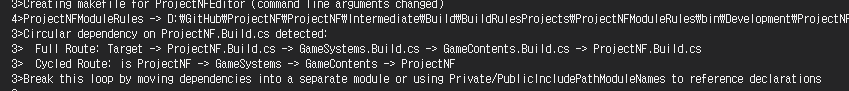

특히 언리얼 엔진에서는 순환 의존성을 좋아하지 않기에 모듈 간의 순환 의존성이 생기면 고치라는 경고 메시지가 나타납니다.

이를 고치기 위해 언리얼 엔진에서 제공하는 델리게이트를 사용할 수 있습니다.

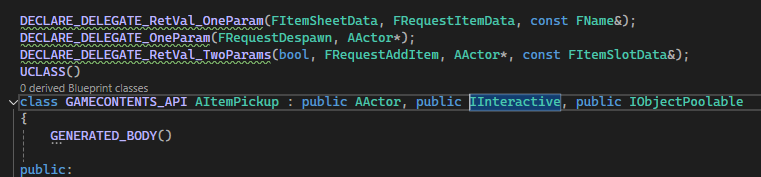

예를 들면, ItemPickup의 외형을 아이템 정보에 맞게 수정하기 위해서는 ItemSheetData를 확인하여 Thumbnail을 읽어야합니다.

그러나 UNFGameInstance::GetItemData()를 사용하기 위해서는, GameContents 모듈이 GameSystem 모듈을 Dependency 모듈로서 참조해야 사용이 가능합니다. 

문제는 이미 GameModule에서는 GameContents를 Dependency 모듈로서 참조하고 있고, 서로 참조를 하면 순환 의존성이 발생할 수 있습니다.

이를 해결하는 방법은 위의 스크린샷처럼 ItemPickup에서 델리게이트를 선언하고, GameSystem에서 해당 객체를 처음 생성시 델리게이트에 아이템 정보를 얻는 static 함수를 등록하는 것입니다.

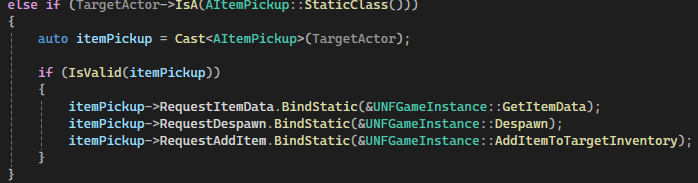

ObjectManager에서는 오브젝트를 생성된 뒤에 해당 오브젝트인지 확인 후, 오브젝트의 델리게이트에 static 함수를 등록해주는 기능을 포함합니다. 이런 방식을 사용해 모듈간의 순환 의존성을 줄여 사용할 수 있습니다.